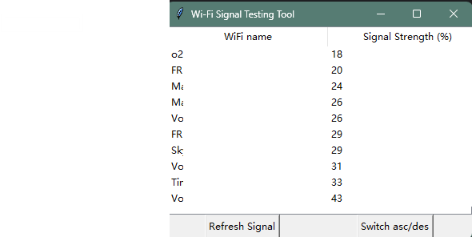

# WiFi Scanner 🛰️


🚀 **WiFi Scanner** 是一个用于扫描 WiFi 信号强度的工具，支持 Windows 和 Linux，基于 `Python` + `Tkinter` 构建，并通过 `PyInstaller` 打包为可执行文件。

---

## ✨ 功能 Features
✅ **扫描 WiFi 信号强度** 📡  
✅ **按信号强度排序** 📊（可切换：最强/最弱）  
✅ **GUI 界面（Tkinter）** 🖥️  
✅ **一键打包 `.exe` / Linux 可执行文件** 🔧  



---

## 🚀 安装 & 运行
### **1.直接下载可执行文件**

- **Windows 用户**：下载 [`wifi_scanner.exe`](https://github.com/FritzZhang/wifi-scanner/releases/latest) 并双击运行

### **2.本地生成可执行文件**
- **Windows 用户**: 命令行输入并运行 ```pyinstaller --onefile --windowed --add-data "wifi_scanner.py;." --add-data "gui.py;." --name wifi_scanner main.py```

## License
This project is licensed under the **GNU General Public License v3.0** - see the [LICENSE](LICENSE) file for details.
